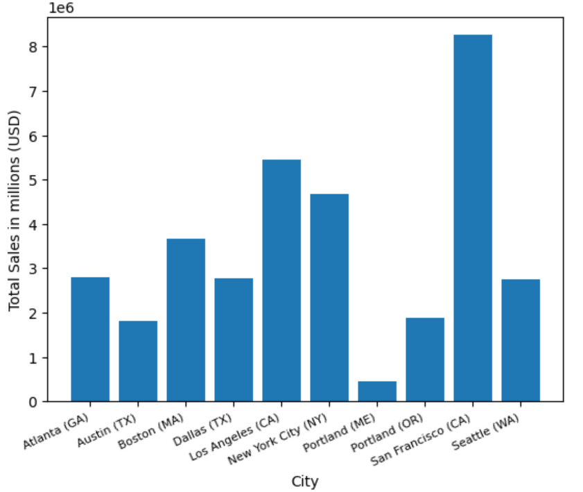

# 📊 Sales Data Analysis with Python Project

This project was a comprehensive analysis of sales data for a fictional company. The goal was to merge, clean, and analyze monthly sales data to uncover business insights such as the best sales months, best sales cities, top-selling products, and optimal advertising strategies based on location and time.

---

## 📁 Project Overview

The notebook processes a collection of monthly sales CSV files, consolidates them into a single dataset, and performs exploratory data analysis (EDA) to answer key business questions:

- **Which month had the highest sales?**
- **Which city generated the most revenue?**
- **What time should advertisements be displayed to maximize customer engagement?**
- **Which products are most frequently sold together?**
- **Which products are top sellers and how does pricing affect sales volume?**

- ---

## 📝 How to Run

1. Clone this repository or download the project files.
2. Place your monthly sales CSV files inside a `Sales_Data` directory in the root folder.
3. Open the `Sales_Analysis.ipynb` notebook in Jupyter or VS Code.
4. Run the notebook cell by cell to process the data and view insights.

---

## 📊 Features & Insights

- **📈 Monthly Sales Analysis**  
  The analysis revealed that **December had the highest total sales, exceeding $4.6 million**. This indicates a strong seasonal trend likely driven by holiday shopping.
  

  🔍 **Recommendation**: Increase marketing spend, promotional offers, and inventory stock in the last quarter of the year, especially during December to capitalize on the peak in consumer spending.

  **🏙️ Sales by City**  
  By extracting city and state information from the purchase addresses, I found that **San Francisco generated the most revenue among all cities analyzed**.  

  
  
  🔍 **Recommendation**: Focus advertising efforts and promotional campaigns in San Francisco and other high-performing cities like Los Angeles and New York City, while investigating ways to boost sales in underperforming regions.

  **🕑 Optimal Advertisement Timing**  
  The dataset was enriched by extracting the **hour of the order** from the order date. A time-based analysis typically shows customer purchase patterns peaking during specific hours of the day.  

  
  
  🔍 **Recommendation**: Schedule targeted online advertisements and email marketing campaigns during high-traffic hours (like evening and late afternoon) to maximize conversion rates. In the analysis specifically 11am and 7pm (19hrs).

  **📦 Frequently Sold Together Products**  
  Grouping by order IDs to identify **product combinations frequently purchased together** offers insights for product bundling strategies. For example, if customers often buy laptops with mouse or laptop stands, these can be bundled as a promotional offer.  

  
  
  🔍 **Recommendation**: Implement combo deal promotional offers and cross-sell recommendations on the e-commerce platform to increase average transaction value.

  **🎯 Top-Selling Products & Price Sensitivity**  
  A product-level sales analysis revealed which products had the highest sales volume. Comparing this against product prices helped identify price sensitivity patterns. Typically, high-volume sales of lower-priced items drive revenue through volume, while premium items contribute through margin.  

                       
  
  
  
          
 
  

  
  🔍 **Recommendation**: Balance inventory based on sales volume trends — maintain healthy stock levels for bestsellers, and consider price adjustments or promotions for slow-moving items.

  ## 👏 Acknowledgements

A special thanks to [Keith Galli](https://github.com/KeithGalli) for dataset creation and inspiration.
  
